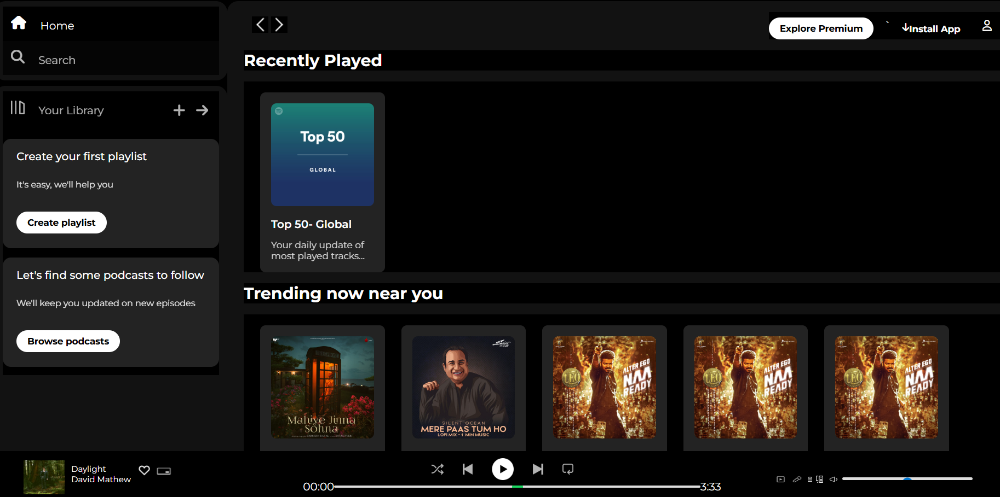

# Spotify Clone

A simple **Spotify clone** built using HTML and CSS. This project focuses on replicating the **UI/UX** of Spotify's web interface. It is a **static clone**, so it does not have any real functionality or backend integration.

## Demo

You can open the `index.html` file in your browser to see the layout.

## Screenshot

  


## Features

- Clean and responsive layout
- Navigation bar similar to Spotify
- Playlist section and music cards
- Footer with media controls (static)
- Styled using CSS to mimic Spotify’s theme


## Technologies Used

- HTML5
- CSS3
- Google Fonts & Icons (optional)

## How to Run

1. Clone the repository:
   ```bash
   git clone https://github.com/<USERNAME>/spotifyl-clone.git
